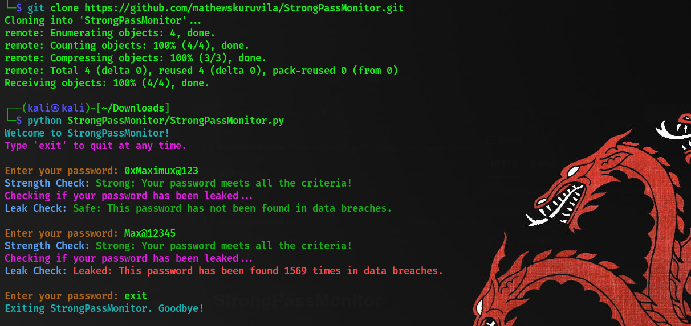

# StrongPassMonitor
## Demo



---
Welcome to **StrongPassMonitor**, a Python-based tool to assess the strength of your passwords and check if they have been compromised using the [Have I Been Pwned API](https://haveibeenpwned.com/). This tool aims to help users enhance their password security by providing actionable feedback and ensuring safer online practices.

---

## Features

- **Password Strength Checker**:
  - Validates password strength based on length, use of uppercase/lowercase letters, digits, and special characters.
  - Provides clear feedback on how to improve weak passwords.

- **Password Leak Check**:
  - Uses the "Have I Been Pwned" API to determine if a password has been compromised in data breaches.
  - Provides the number of times the password has appeared in breaches (if any).

- **User-Friendly**:
  - Interactive command-line interface.
  - Color-coded outputs for easy readability.

---

## Prerequisites

Ensure the following dependencies are installed:

- **Python**: Version 3.7 or above.
- **Pip**: Python package manager.

---

## Installation

1. **Clone the Repository**:
   ```bash
   git clone https://github.com/mathewskuruvila/StrongPassMonitor.git
   cd StrongPassMonitor
   ```

2. **Install Dependencies**:
   Use the following command to install required Python libraries:
   ```bash
   pip install -r requirements.txt
   ```

   **Required Libraries:**
   - `requests`
   - `colorama`

---

## Usage

1. Start the tool by running the script:
   ```bash
   python strongpassmonitor.py
   ```

2. Follow the prompts to:
   - Enter a password to check its strength.
   - (Optional) Check if the password has been leaked in any known data breaches.

3. Exit the program at any time by typing `exit`.

---

## Disclaimer

- This tool does not store or share your password data.
- Always use this tool responsibly and do not use it to check passwords you do not own.


